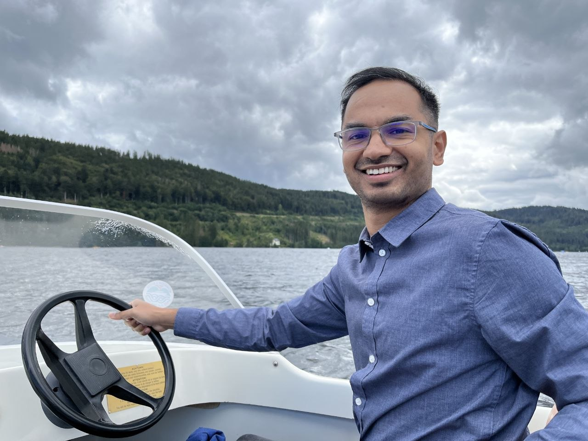

  
  

    <h1>Raghu Rajan</h1>
    
I am a Postdoctoral Researcher at the Neurorobotics Lab at the University of Freiburg. My research focuses on reinforcement learning, with a particular interest in automated reinforcement learning (AutoRL) and methods for improving robustness and efficiency in reinforcement learning.

  

### Contact & Socials

<a href="https://scholar.google.de/citations?user=yO9vfx8AAAAJ&hl=en" target="_blank"> Scholar</a> &nbsp; | &nbsp;
<a href="https://github.com/RaghuSpaceRajan" target="_blank"> GitHub</a> &nbsp; | &nbsp;
<a href="https://x.com/RaghuSpaceRajan" target="_blank"> Twitter</a> &nbsp; | &nbsp;
<a href="https://bsky.app/profile/raghuspacerajan.bsky.social" target="_blank"> BlueSky</a> &nbsp; | &nbsp;
<a href="https://www.linkedin.com/in/raghuspacerajan/" target="_blank"> LinkedIn</a> &nbsp; | &nbsp;
<a href="https://www.instagram.com/raghuspacerajan/" target="_blank"> Instagram</a>

---

### Affiliation
[Neurorobotics Lab – University of Freiburg](https://nr.informatik.uni-freiburg.de/people/raghu-rajan)
